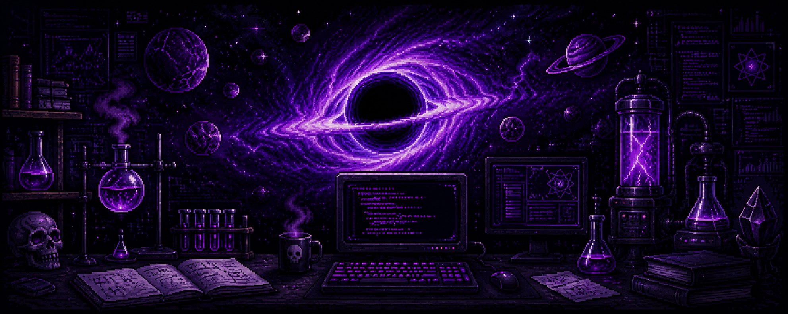

 

# Adi

 

---

## About me:

hi, i'm **Adi** — a master's student and researcher at Mississippi State University.

I build uncertainty-aware ML systems for noisy physical environments — places where standard confidence estimates break down and you need guarantees that actually hold.

my current work applies **conformal prediction** to gravitational wave detection, closing the gap between synthetic training data and real LIGO detector noise.

prior work uncovered the *Evaluation Paradox* in physics-constrained time series — proving that standard random splits mask temporal dependencies and produce invalid model selection.

> research → build → validate → publish → repeat

long-term: **black holes · particle astrophysics · the information paradox**

---

&nbsp;

